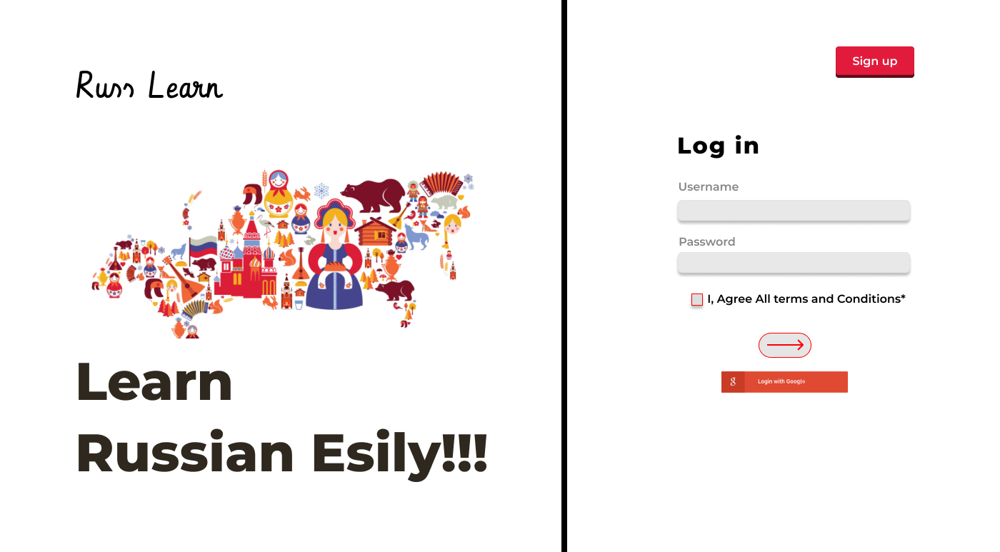
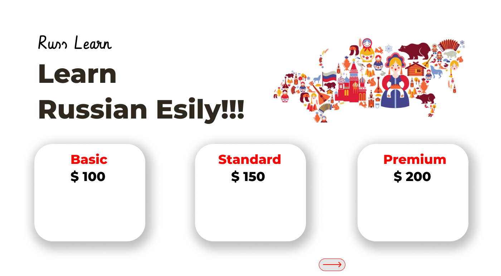

[](https://github.com/ParthKalkar/RusLearn/actions/workflows/pylint.yml)
[](https://github.com/ParthKalkar/RusLearn/actions/workflows/deploy.yml)
[](https://github.com/ParthKalkar/RusLearn)
[](https://github.com/yegor256/takes/blob/master/LICENSE.txt)
# [RusLearn](http://ruslearn-dev.us-west-2.elasticbeanstalk.com/)

> With RusLearn, we want to provide a large platform built on the idea and learning philosophy of flashcards: Simple and atomic units of knowledge, that have been 
scientifically proven to be one of the most effective learning methods, especially when used in combination with techniques such as spaced repetition. RusLearn saves you the time and 
effort of understanding these learning techniques by implementing everything internally and guiding you completely through your learning experience, with no extra effort on your side except the small bursts 
of focus in the short learning sessions. RusLearn also offers premium tier subscriptions, which offer you further high quality content with the flashcards, such as video, audio, and external links. 
Moreover, you should know that RusLearn offers more than just flashcards for you to review. If you have confidence in your knowledge of a certain subject or language, you can contribute to the platform with your own flashcards and earn money with them! 
A user can select the “tutor” subscription tier, which instead of taking your money, gives you money (depending on how well your flashcard packs are doing, and how popular they are).
---
## Table of contents
- [Business Relevance](https://github.com/ParthKalkar/RusLearn#business-relevance)
- [Progress](https://github.com/ParthKalkar/RusLearn#what-we-have-so-far)
- [Stakeholders](https://github.com/ParthKalkar/RusLearn#stakeholders)
- [Server Architecture](https://github.com/ParthKalkar/RusLearn#server-architecture)
- [UML design diagrams](https://github.com/ParthKalkar/RusLearn#sample-uml-diagrams-of-the-features)
- [User Interface Design](https://github.com/ParthKalkar/RusLearn#user-interface-design)
- [More artifacts (RUP)](https://github.com/ParthKalkar/RusLearn#more-artifacts)
- [Developer guide](https://github.com/ParthKalkar/RusLearn#developers-guide)
- [Authors & Copyright](https://github.com/ParthKalkar/RusLearn#authors)
---
## Business relevance:
#### Competitors
Flashcards app (like Anki, Quizlet, Memrise,...), and platforms for earning through making flashcards (like Stuvia, ProProfs, …).
#### Challenge
- Many similar apps on the market, but none of them provide tutor roles, or features like batch input when creating flashcards (input with multiple lines of words)
- Most of the learning packs created serve the community for free, the owner gains nothing but popularity
#### How we solve
- Provide batch input for users
- Enable money-making functionality for users who reach certain criteria (similar to Spotify, Youtube...)
#### What make us unique
- Financial-driven motivation: there will be two types of users: those who learn and those who create to not just share but earn money.
- Since people actually pay to subscribe to a pack, the community review of a pack is improved as well as the quality of it.
#### Objectives
- Create a marketed version of quizlet
- Solve some tiny user experience details the apps on market is having 


## What we have so far:
In its current stage, RusLearn is a web-application that accompanies users on the journey of learning the Russian language by:
- Applying flashcards memorizing technique
  
- Offering both standard and community-based flashcard packs.
  
- Offering premium subscriptions besides the free plans.
  
The initial idea of RusLearn stems from the following problems:
- The shortage of similar applications on the market
  
- The similar applications don't offer the same set of features
- Costly subscription that can't be afforded by students.

## Stakeholders


| **Stakeholder’s Name** | **Roles** | **Responsibilities** |
| ----- | ----- | ------ |
| **Tester** | - Testing functionalities of the application - Set up the benchmark environment - Run the functionality | Note down the results and report bugs 
| **Developers** | Develop the application | Be aware of all user stories, FR (functional requirement), and NFR (non-functional requirement) - Apply the proper technology to develop each submodule - Test, debug repeat, comment the code - Define and document requirements - Provide information, estimates and feedback to the Project manager
|**Project Manager**|Planning, executing, monitoring, controlling, and closing out the project.|Accountable for the entire project scope - The project resource and budget - The success or failure of the project
|**Product Owner** | Set deadlines, financial management, propose requirements, validate project | Schedule delivery deadline (hard/soft) - Describe what customers expect - Present the deliveries to the customer - Handle the budget/bargaining - Validate if each delivery matches customer’s needs: validation goals
|**Investor / Client** |Pay, experience, require |State out core ideas of the product, how it should look, how it should function. - Be on time on payment - Confirm if each delivery satisfies them.
---
## Server Architecture

## Sample UML diagrams of the features

## User Interface Design




## More artifacts:
If your looking for any of the following:
- RUP development plan
- Functional requirements
- Non-functional requirements
- User stories
You can find them in [this document](https://docs.google.com/document/d/1xzDPuQek72qCGHcejrLsAYMtsXDgOepC/edit?usp=sharing&ouid=110717885064894218528&rtpof=true&sd=true)

## Developer's guide
RusLearn is open-source. Anyone is welcome to contribute given that they follow our [code of conduct](./CODE_OF_CONDUCT.md).
### Technical stack
The platform is mainly built around a *Django* backend server, that connects the frontend *React.js*
server to a *PostgreSQL* database using a RESTful JSON API. 


The platform also uses other 3rd party services such as:
- *The PayPal API*: used for payouts to tutors on the platform.
- *The Stripe API*: used to receive student monthly subscription payments.
- *Google Firebase Authentication*: Used to integrate with Google accounts.

### Installation guide (*Debian Linux environment*)
First, clone the GitHub repository in your directory of choice:
```commandline
git clone git@github.com:ParthKalkar/RusLearn.git
```
Make sure you have Python installed:
```commandline
sudo apt-get install python3 python3-pip virtualenv
```
Make sure you have Node.JS installed:
```commandline
sudo apt-get install npm
```
In the project's directory, create a Python virtual environment and activate it:
```commandline
virtualenv venv && source venv/bin/activate
```
Now install all the Python dependencies:
```commandline
pip3 install -r requirements.txt
```
To migrate the database and create the database tables:
```commandline
python3 manage.py makemigrations && python3 manage.py migrate
```
Once the migrations are done, you will be able to run the backend server locally using:
```commandline
python3 manage.py runserver
```
To run the frontend React server, open the terminal in the `react-app` directory and run:
```
npm start
```

### Deployment guide
You can deploy the website on Amazon Web Services Elastic Beanstalk, by executing the next steps:
1. Make 2 `.zip` files from the source code, the first file should contain the `react-app` directory, the second file should contain all the files except the directory of the first file.
2. Deploy the files to separate Elastic Beanstalk environments.
3. In the React App environment, specify the environment URL of your backend server in main.js.
4. In the Django environment, add the current environment URL in the `ALLOWED_HOSTS` in the `settings.py` file.
---
## Authors:
*[Rafik Hachana](https://github.com/RafikHachana)*, *[Parth Kalkar](https://github.com/ParthKalkar)*, *[Danil Shalagin](https://github.com/danilXX2000)*, *[Truong Nguyen](https://github.com/enestydarealmc)*

## Copyrights:
This is a student project done during the course of SSAD *(Software Systems Analysis and Design)* in *Innopolis University*, *Fall semester 2021*. Therefore, we claim the authority of all source code being used here.
In addition, fair use of this source code can be done within the MIT copyright license
