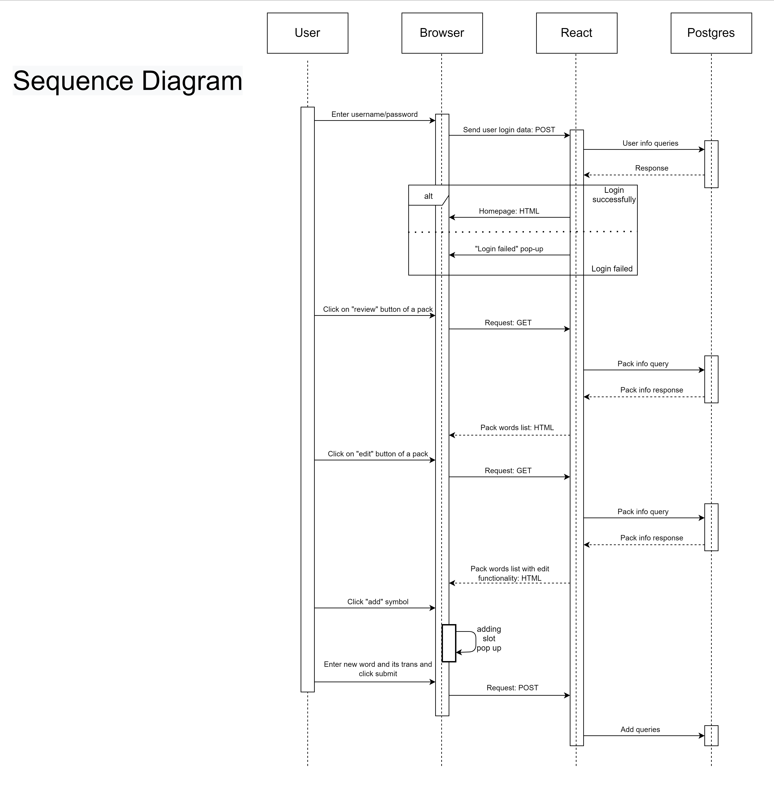

# Design

## Table of contents
- [Project description](../README.md)
- [Business Goals and Objectives](../README_buisiness_goals.md)
- [Requirements](Readme_content/README_req.md)
- Design
    - Sample UML diagrams of the features
        - Sequence diagram
        - Use-Case Diagram
    - Pattern
    - SOLID
- [Architecture](Readme_content/README_arch.md)
- [Code](Readme_content/README_code.md)
---

## Sample UML diagrams of the features
### Sequence diagram

### Use-Case Diagram

## Pattern
Back-end code is written on django and it uses **MVT (Model-View-Template) pattern**.

**MVT** model-view-template:

- **Model** manages the data and is represented by a database.In our case it is classes that represent database tables and can be used to access them.

- The **View**  is a function that receives HTTP requests and sends HTTP responses. A view interacts with a model and template to complete a response. In our code view is a set of functions that are used to access and modify databases.

- The **Template** is basically the front-end layer and the dynamic HTML component of a Django application.

## SOLID
On this moment, we follow 2 SOLID principles:
1. Single Responsibility

All classes responsible have a single responsibility: store data. For example, the Users class stores data about users. It means models follow a single responsibility principle.

3. Liskov Substitution

The Liskov substitution principle states that if S is a subtype of T, then objects of type T may be replaced (or substituted) with objects of type S. 
All classes in models file extend models.Model and all functions from base class can be applied to child class. Thus it follows Liskov Substitution.
